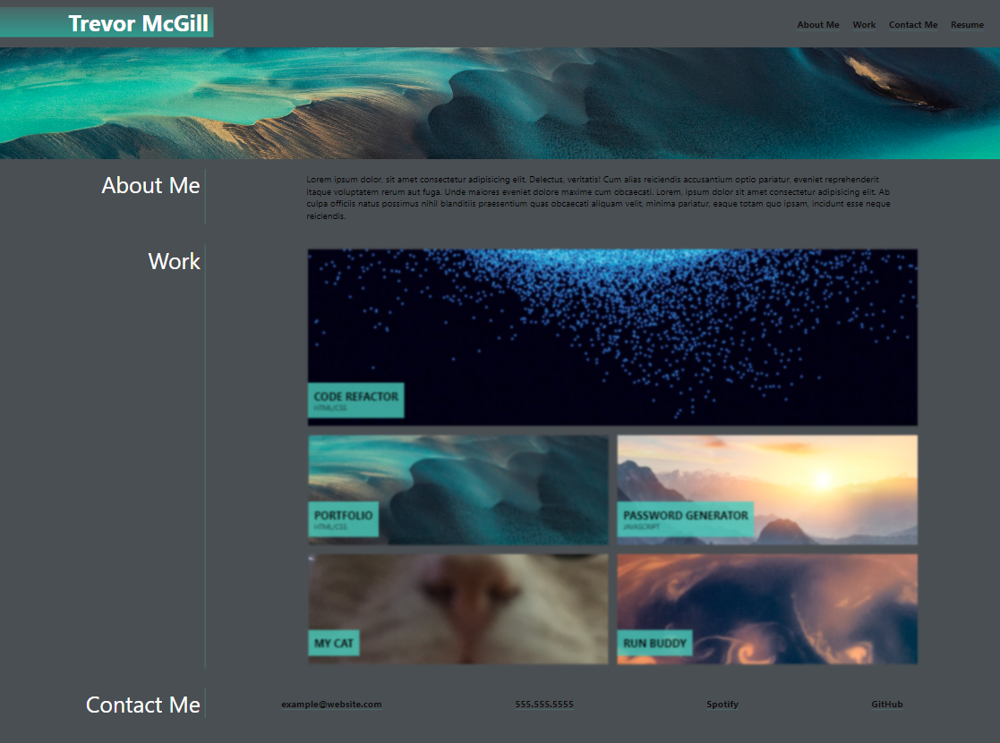

# Challenge Portfolio

## Description
In this challenge, the goal was to create a portfolio website to showcase my work. I used the core skills that I've recently learned to make my website look professional and user-friendly. To make my website more interactive, I used pseudo-classes to make the preview images of my work blurry until they're hovered over by the mouse. I also made sure that my website was mobile-responsive by using media queries. This ensured that the layout and design of my website would adjust to fit different screen sizes, making it accessible to a wider range of users.

## Portfolio Preview

## Deployed Website

[My Portfolio!](https://trevormcgill.github.io/challenge-portfolio/)